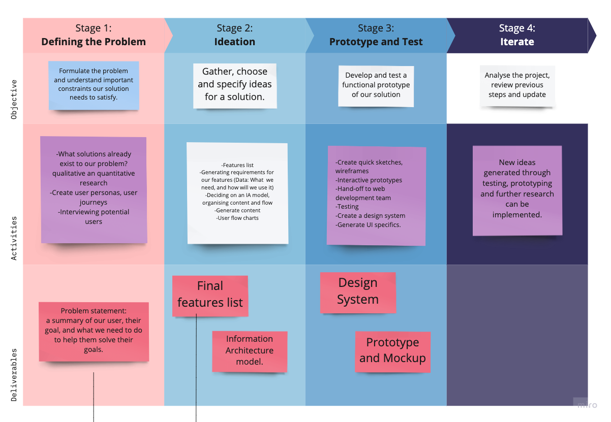
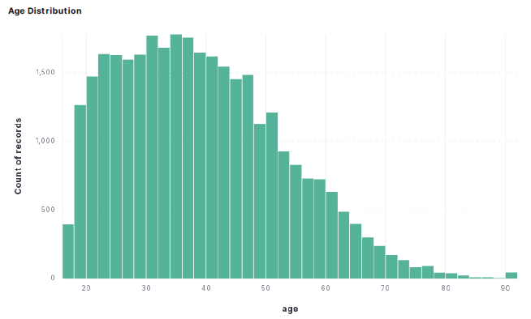
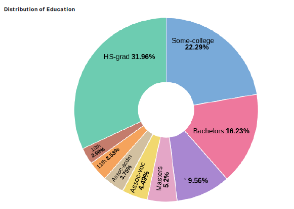
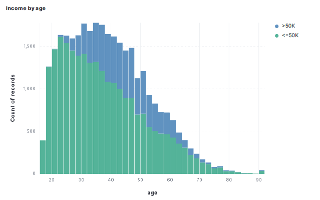
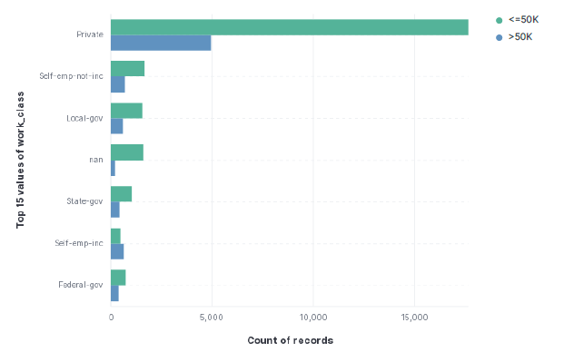
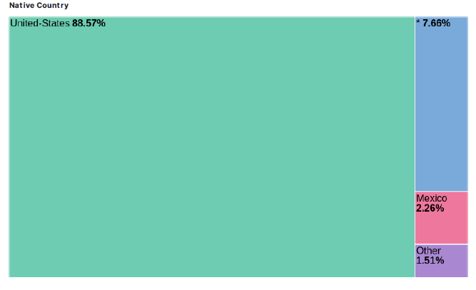
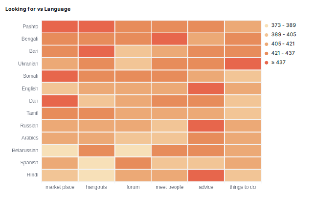
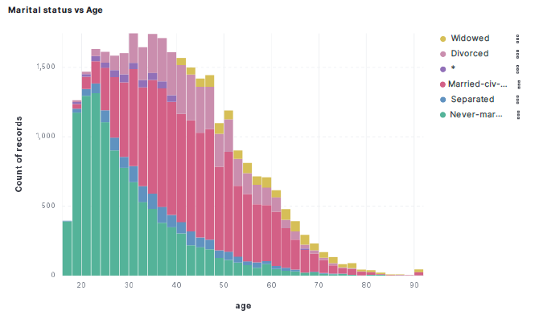
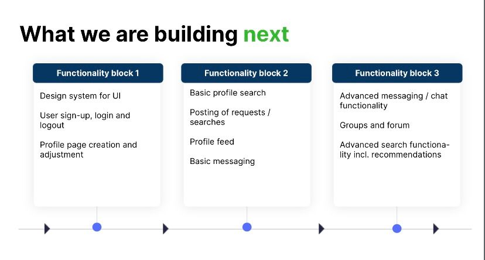

# st22-stronger-together

A lot of people are unaware of the refugee crisis. The UNHCR defines a refugee as an individual who has been forced to flee their country because of persecution, war, or violence. In 2015, over 65 million people were refugees worldwide and that number is continually rising. There are now more refugees than at any other time in human history which means there is a great need for applications that can help new arrivals integrate into their new home countries smoothly.

We researched different refugee apps, and their needs, and developed ours based on the findings. Our app helps them to connect with other refugees and locals, and learn about the resources available in their new country, particularly in the city of Berlin, Germany. 

## Stronger Together

**Problem Statement**: Recently arrived refugees, are often at a loss and feel isolated when they need to start a new life in Berlin. With an app, they will be able to connect with local people and other refugees or migrants who can help them discover the city, and build a community. At Stronger Together, we are building a community where refugees can find the help they need, where they can find friends to hang out with, and where they can chat with locals to learn more about the city.

Our work team was divided into 3 branches: Data Science, User Experience, and Web Development. 

**User Experience**

At the very early stages of the project, we defined our working style, set up a weekly meeting of the whole team, sharing our findings and expectations of the project. At first, we answered pressing questions about the project and what we all expected of it to be on the same page. A brainstorming session involving the whole team took place and answered the following questions: 

1. What is the project about? 
2. What are the goals? 
3. What is the timeline?
4. Do we have data?

This brainstorming exercise leads us to similar answers: 

> Help refugees find the tools that are necessary to start a life in Berlin
> 

> An App for refugees, asylum-seekers, and stateless people in Berlin, helping them or helping people helping them integrate into a new country and community.
> 

> Mediator between people, who need help, and people who can provide that help. You enter the platform, register, and fill out the form with your needs (or the kind of help you want to provide). The platform matches you with a person or resource, which is relevant to your case. Would be nice to have a chat, where people could exchange information.
> 

More on our brainstorming here: [https://miro.com/app/board/uXjVOynRfGc=/?moveToWidget=3458764529673845329&cot=14](https://miro.com/app/board/uXjVOynRfGc=/?moveToWidget=3458764529673845329&cot=14)

With all of this knowledge, and as members of the UX track, Daniela and Pablo set out to create a design process so the whole team could follow. 

Our design process consisted of 4 stages, each with an objective, activities, and deliverables. 

After our initial brainstorming and ideation session, the UX team undertook research that lead to the development of user personas, scenarios, and the selection of app features, such as: feed, hangouts, chat and marketplace. Building on this, we developed an user journey, wireframes, and a prototype of the app that, in the next step, underwent usability testing. 

### Data Science

The Data Science team worked on gathering data, cleaning and analysing it, and creating an algorithm that recommends users to other users they could connect to.

To have enough data to implement the steps mentioned above we first mocked the data using a database from patients who entered the UCI in a hospital in the United States and then added new columns such as what they are looking for, languages and interests. We used this data to create some analytics using a tool called Elastic. Analysis such as age distribution, education distribution, income by age, top values of work class, native country, looking for vs language and marital status vs age. 

For our recommendation algorithm, we started using the sklearn library to build a content-based filtering recommendation engine. This engine takes the characteristics we find most relevant from the database: 'age', 'marital status', 'occupation', 'Interests', 'Looking for', 'Language’, and compares all values in the dataset with each other based on these characteristics, this is done through a cosine similarity matrix. Finally it sorts them and shows the most similar users based on those characteristics to a user you specify.

Additionally, we used a linear regression model to create matches that would go beyond similarity. This way, matches would not necessarely be similar to the user. For example, this could take into account that people looking for help would best match with people offering help. This model is also trained based on a list of id's the user is a match with. This means once the product would be live, we could add a data point (for example 10 messages exchanged both ways) to define a successful message, and use that data to train the model more accurately.

### Web Development

We divided the development process into 3 blocks, based on priority of functions. 

We built ‘skeletons’ for priority pages (landing page, log in, basic profile view) using HTML, CSS, and JavaScript.

Thanks to our experienced mentor, we reviewed the trajectory of the project after some weeks, and we decided to implement the use of React.JS with Material. UI, which was useful and interesting for us to be learned. For the Backend we also used Firebase.

The biggest challenge we had was setting up the interaction between Firebase and the rest of the React.JS part of the project. At some stages of the project, we faced difficulties with time management and some technical skills.

Nevertheless, at the end of this period, we managed to deliver all the planned pages, from the functional block with the highest priority (landing page, log in, sign up) to our defined medium-priority functional block (which included, for example, feed and profile pages).

In the end the project experience showed us that is important to work together as a team, and use the knowledge of all the tracks to be able to create a working app. As migrants we understood that developing this app went beyond learning technical skills - we also wanted to create something meaningful that could help other people.